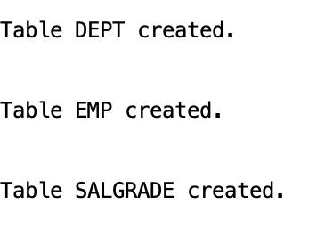
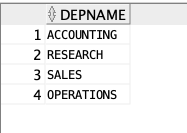
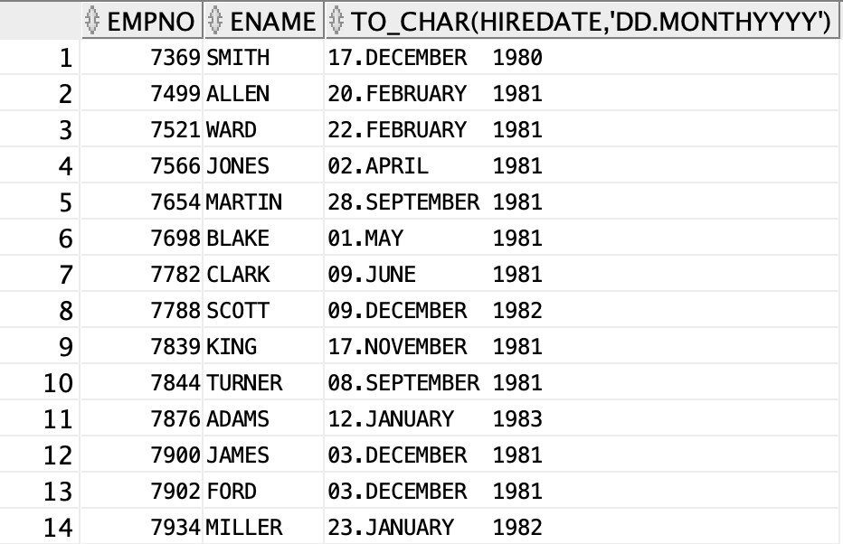
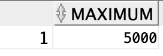
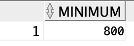
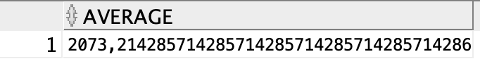
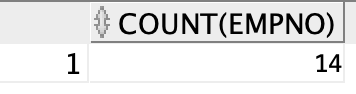

# Simple SQL Queries

## Create Tables

### Statement
```sql
CREATE TABLE DEPT (
    deptNo,
    dName,
    loc
) AS SELECT * FROM DEMO_DEPTEMP.DEPT;

CREATE TABLE EMP (
    empNo,
    eName,
    job,
    mrg,
    hireDate,
    sal,
    comm,
    deptNo
) AS SELECT * FROM DEMO_DEPTEMP.EMP;

CREATE TABLE SALGRADE (
    grade,
    losal,
    hisal
) AS SELECT * FROM DEMO_DEPTEMP.salgrade;

```


### Result


## Naming columns in a result set

### Statement

```sql
SELECT DNAME DepName FROM DEPT;
```

### Result


## Removing duplicate records
### Statement
```sql
SELECT DISTINCT job FROM EMP;
```

### Result


## Date Format

### Statement
```sql
SELECT EMPNO, ENAME, TO_CHAR(HIREDATE, 'DD.MONTH YYYY') FROM EMP;
```

### Result



## Date Calculations

### Statement
```sql
SELECT ENAME, CURRENT_DATE - HIREDATE DAYS FROM EMP;
```

### Result


## Upper bounds

### Statement
```sql
SELECT MAX(SAL) FROM EMP;
```

### Result


## Lower bounds

### Statement
```sql
SELECT MIN(SAL) FROM EMP;
```

### Result



## Average

### Statement
```sql
SELECT AVG(SAL) FROM EMP;
```

### Result


## Simple Counting

### Statement
```sql
SELECT COUNT(EMPNO) FROM EMP;
```

### Result



## Counting unique Results

### Statement

```sql
SELECT COUNT(DISTINCT JOB) FROM EMP;
```

### Result


